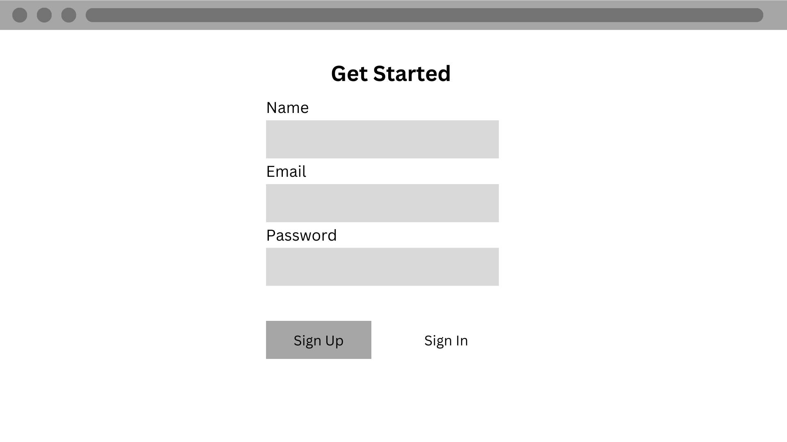
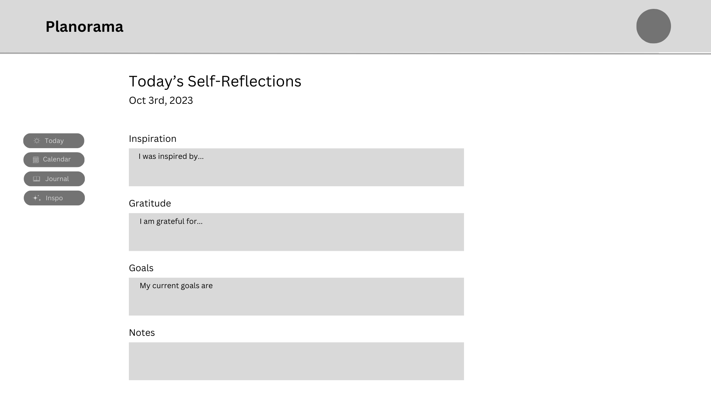

# Wireframes

Reference the Creating an Entity Relationship Diagram final project guide in the course portal for more information about how to complete this deliverable.

## List of Pages

[👉🏾👉🏾👉🏾 List the pages you expect to have in your app, with a ⭐ next to pages you have wireframed]

## Wireframe 1: Register/Login Page ⭐

## Wireframe 2: Calendar Page ⭐

## Wireframe 3: Today Page ⭐

[👉🏾👉🏾👉🏾 include more wireframes as desired]
